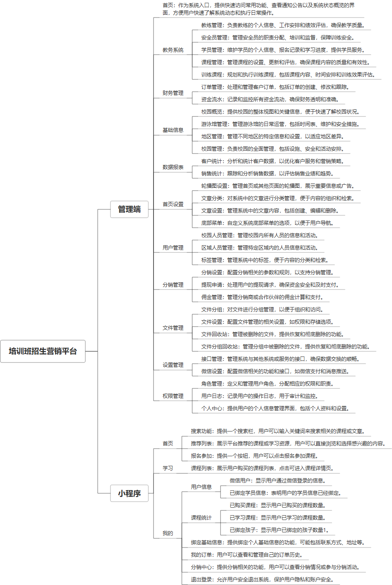

 

    
 

公司拥有上百套具有自主知识产权的软件系统，详情请查看码云首页或公司官网

 
<h1>培训班招生营销平台</h1>

<a href="https://www.haishi.net.cn/">公司官网</a> ｜ <a href="https://www.haishi.net.cn/">在线体验</a>

 

## 系统介绍

培训班招生营销系统是一款集校园管理、教务系统、教练管理、学员管理、课程管理、财务管理等多功能于一体的综合性管理系统。该系统通过校园概览、轮播图设置、底部菜单设置等首页设置，提升校园形象，吸引潜在学员；通过教练管理、学员管理、课程管理等模块，实现招生、教学、教务的高效运作；同时，利用数据报表、客户统计、销售统计等功能，精准分析市场动态，优化招生策略；此外，系统还具备财务管理、分销管理、标签管理等功能，全面支撑培训班的运营管理和营销推广。
培训班招生营销系统是一款集校园管理、教务系统、教练管理、学员管理、课程管理、财务管理等多功能于一体的综合性管理系统。该系统通过校园概览、轮播图设置、底部菜单设置等首页设置，提升校园形象，吸引潜在学员；通过教练管理、学员管理、课程管理等模块，实现招生、教学、教务的高效运作；同时，利用数据报表、客户统计、销售统计等功能，精准分析市场动态，优化招生策略；此外，系统还具备财务管理、分销管理、标签管理等功能，全面支撑培训班的运营管理和营销推广。
本项目名称为培训班招生营销平台，是一个面向培训机构招生营销管理的综合性平台。该平台集成了教务管理、财务管理、基础信息管理、数据报表、首页设置、用户管理、分销管理、文件管理和权限管理等核心模块，旨在帮助培训机构提高招生效率、优化运营管理，并提升客户满意度。
本项目包含以下几个终端：
- 管理后台：供培训机构内部人员使用，涵盖所有功能模块，用于管理教务、财务、用户、营销等各项事务。
- 用户端（推测）：可能存在学员端或家长端APP或小程序，用于报名、缴费、查看课程安排、与教练沟通等。
- 分销端（推测）：可能存在分销人员使用的APP或小程序，用于推广课程、获取佣金等。
                

## 系统功能介绍

### 系统包含终端说明

管理端（WEB）、用户端（微信小程序）

| 序号 | 模块 | 模块说明 |
| --- | --- | --- |
| 1 | JY-YXPT-ZS-MANAGE | 管理端 |
| 2 | JY-YXPT-ZS-MP | 小程序 |
| 3 | JY-YXPT-ZS-SERVER | 服务端 |

### 系统功能结构

### 系统功能说明

核心功能：
- 教务系统：涵盖教练管理、安全员管理、学员管理、课程管理和训练管理，实现对培训过程的全面掌控。
- 财务系统：包括订单管理和资金流水管理，方便财务人员进行收入支出管理和统计分析。
- 用户管理：包含用户管理、校园人员管理、区域人员管理和标签管理，实现对不同角色用户的权限控制和信息管理。
- 分销管理：包含分销设置、提现申请和佣金管理，支持分销渠道的拓展和管理。
- 数据报表：提供客户统计和销售统计，为运营决策提供数据支持。
其他功能：
- 登录系统
- 首页
- 基础信息：包括校园概览、游泳馆管理、地区管理和校园管理。
- 首页设置：包括轮播图设置、文章分类、文章设置和底部菜单。
- 文件管理
- 权限管理：包括角色管理、用户管理和用户日志。

## 系统主要界面

## 系统技术说明

### 代码模块说明

| 序号 | 目录 | 目录说明 |
| --- | --- | --- |
| 1 | JY-YXPT-ZS-SERVER/extend | -- |
| 2 | JY-YXPT-ZS-SERVER/app | -- |
| 3 | JY-YXPT-ZS-SERVER/route | -- |
| 4 | JY-YXPT-ZS-SERVER/config | -- |
| 5 | JY-YXPT-ZS-SERVER/public | -- |
| 6 | JY-YXPT-ZS-SERVER/private | -- |
| 7 | JY-YXPT-ZS-SERVER/vendor | -- |

### 系统技术选型

#### 开发语言/框架

PHP
框架：ThinkPHP
前端框架：VUE2

#### 服务中间件

Nginx

#### 数据库

MySQL（5.7+）
Redis

#### 其他说明

无

## 系统演示/商用

请扫码添加客服微信获取演示地址和系统详细资料。

如果您想基于培训班招生营销平台进行商业化交付或定制开发服务，我们提供有偿的技术服务支持，合作模式不限，欢迎沟通！

公司官网地址： <a href="https://www.haishi.net.cn/">https://www.haishi.net.cn</a>

联系客服获取专业回答。

## 使用须知

1、 本项目商用必须获得版权所有者的授权。

2、 未经允许本项目代码不允许二次出售。

